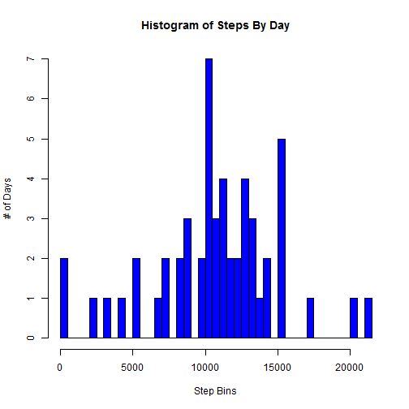
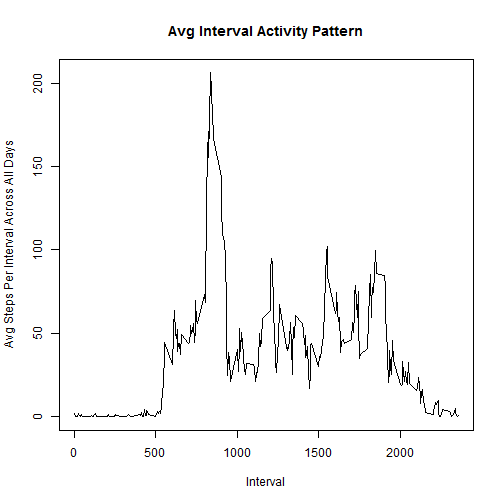
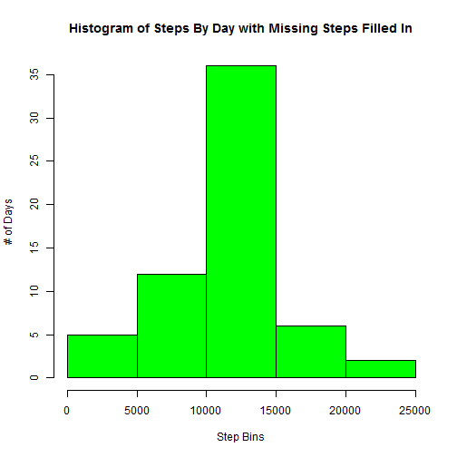
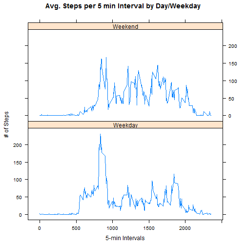

#Download and unzip data file
download.file(url = 'https://d396qusza40orc.cloudfront.net/repdata%2Fdata%2Factivity.zip', destfile = 'activity.zip')
unzip('activity.zip')


```r
library(lattice)
#Load the data (i.e. read.csv())
activity_data <- read.csv(file = 'activity.csv', header = TRUE, sep = ',', colClasses = c("numeric", "Date", "numeric"))

#Process/transform the data (if necessary) into a format suitable for your analysis
steps_by_day <- aggregate(steps~date, data = activity_data, FUN = sum)
```

#What is mean total number of steps taken per day?

```r
#Make a histogram of the total number of steps taken each day
hist(steps_by_day$steps, ylab = "# of Days", xlab = "Step Bins", main = "Histogram of Steps By Day", breaks = 50, col = "blue")
```



```r
#Calculate and report the mean and median total number of steps taken per day
summary(steps_by_day$steps)
```

```
##    Min. 1st Qu.  Median    Mean 3rd Qu.    Max. 
##      41    8841   10760   10770   13290   21190
```

#What is the average daily activity pattern?

```r
#Make a time series plot (i.e. type = "l") of the 5-minute interval (x-axis) and the average number of steps taken, averaged across all days (y-axis)
steps_by_interval_avg <- aggregate(steps~interval, data = activity_data, FUN = 'mean')
plot(steps_by_interval_avg, type = 'l', ylab = "Avg Steps Per Interval Across All Days", xlab = "Interval", main = "Avg Interval Activity Pattern")
```



```r
#axis.Date(1, at = steps_by_day_avg$date, format= "%Y-%m-%d", las = 2, cex.axis = .75)

#Which 5-minute interval, on average across all the days in the dataset, contains the maximum number of steps?
interval_with_most_avg_steps <- steps_by_interval_avg[which.max(steps_by_interval_avg$steps),]

interval_with_most_avg_steps
```

```
##     interval    steps
## 104      835 206.1698
```

#Imputing missing values

```r
# Calculate and report the total number of missing values in the dataset (i.e. the total number of rows with NAs)
number_of_NAs_by_variable <- apply(activity_data, 2, function(x) length(which(is.na(x))))

#Create a new dataset that is equal to the original dataset but with the missing data filled in.
#Missing values filled in using step interval mean
activity_data_imputed <- merge(activity_data, steps_by_interval_avg, by = 'interval', all = TRUE)
activity_data_imputed[is.na(activity_data_imputed$steps.x), 2] = activity_data_imputed[is.na(activity_data_imputed$steps.x), 4]

#Make a histogram of the total number of steps taken each day with missing values filled in
steps_by_day_imputed <- aggregate(steps.x~date, data = activity_data_imputed, FUN = sum)
hist(steps_by_day_imputed$steps.x, ylab = "# of Days", xlab = "Step Bins", main = "Histogram of Steps By Day with Missing Steps Filled In", col = "green")
```



```r
summary(steps_by_day_imputed$steps.x)
```

```
##    Min. 1st Qu.  Median    Mean 3rd Qu.    Max. 
##      41    9819   10770   10770   12810   21190
```

#Are there differences in activity patterns between weekdays and weekends?

```r
#Create a new factor variable in the dataset with two levels - "weekday" and "weekend" indicating whether a given date is a weekday or weekend day.
activity_data_imputed$day <- 'Weekday'
activity_data_imputed$day[weekdays(activity_data_imputed$date) %in% c("Saturday", "Sunday") ] <- 'Weekend'

steps_by_interval_by_day_avg <- aggregate(steps.x~interval + day, data = activity_data_imputed, FUN = 'mean')

#Make a panel plot containing a time series plot (i.e. type = "l") of the 5-minute interval (x-axis) and the average number of steps taken, averaged across all weekday days or weekend days (y-axis). See the README file in the GitHub repository to see an example of what this plot should look like using simulated data.
xyplot(steps_by_interval_by_day_avg$steps.x ~ steps_by_interval_by_day_avg$interval | steps_by_interval_by_day_avg$day, layout = c(1,2), type = 'l', main = 'Avg. Steps per 5 min Interval by Day/Weekday', xlab = '5-min Intervals', ylab = '# of Steps')
```


